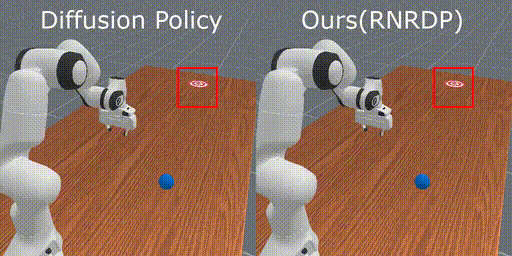
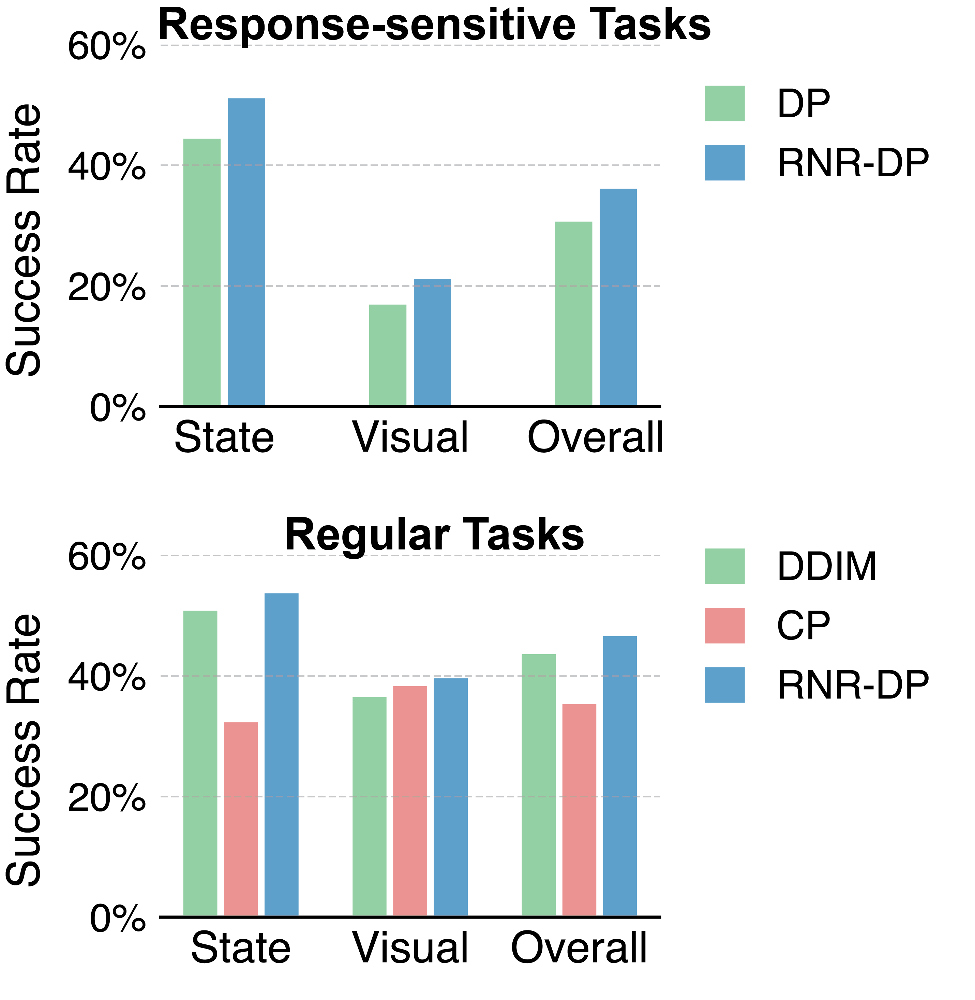

# RNR-DP

Official implementation of

[Responsive Noise-Relaying Diffusion Policy: Responsive and Efficient Visuomotor Control](https://arxiv.org/abs/2502.12724) by

[Zhuoqun Chen](https://zhuoqun-chen.github.io)\*, Xiu Yuan*, [Tongzhou Mu](https://cseweb.ucsd.edu/~t3mu/), [Hao Su](https://cseweb.ucsd.edu/~haosu) (UC San Diego)</br>

*Equal Contribution</br>

TMLR 2025

</br>

[[Project Page]](https://rnr-dp.github.io/) [[arXiv]](https://arxiv.org/abs/2502.12724)

----

## Overview

<br/>


----

## Installation

We provide two different ways to run or install our codebase, depending on your needs. First clone this repo:

```shell
git clone https://github.com/zhuoqun-chen/rnrdp.git
```

### Download Demo Datasets

0. Install [**gdown**](https://github.com/wkentaro/gdown) to download some demo datasets from Google Drive links.

```bash
bash scripts/download/download_ms3_data.sh # for MS3, RollBall-v1 & PushT-v1

bash scripts/download/download_ms2_data.sh # for MS2, turnfaucet & pushchair
# the data are then stored in "data/cotpc_demo_data/TurnFaucet" & "data/cotpc_demo_data/PushChair"

# download and process for ms2::stackcube && ms2::turnfaucet tasks later on
```

### Option 1: via Docker Container

When you just want to run the experiments without modifying the code, we recommend using our pre-built Docker image. This is the easiest way to get started.


1. Install [**(Linux) Docker**](https://docs.docker.com/engine/install/ubuntu/). (**Ensure non-root users have Docker permissions.**)

2. Install [**(Linux) NVIDIA Container Toolkit**](https://docs.nvidia.com/datacenter/cloud-native/container-toolkit/latest/install-guide.html) to enable GPU support in docker. (**Installation and Configuring Docker steps are required.**)
3. Run one of the example experiment (`RollBall-v1`) as simple as:

```shell

# pull the image from dockerhub and start the container
bash run_docker.sh

# here your are already in the container shell
bash scripts/docker/train_rnrdp_state_ms3_rollball.sh
```

4. (Optional) If you want to use [Weights and Biases](https://wandb.ai) (`wandb`) to track the experiment, add `--track` at the end of the script, and paste your valid `WANDB_API_KEY` in `.env` file before `run_docker.sh`.

An example of the performance comparison of ours method with `Diffuision Policy (DP)` on `ms3 rollball state` task is shown here: https://wandb.ai/zqchen33/rnrdp.

### Option 2: Manual Installation

When you want to play with the code and modify it, we recommend installing the codebase manually. This will give you more flexibility and control over the code.

1. We use `uv` for fast python dependency management across `MS2` & `MS3`. Install `uv` binary first by following https://docs.astral.sh/uv/getting-started/installation/.

2. Install all `MS2` & `MS3` dependencies by running the following command:

    ```bash
    # for ManiSkill2 experiments & Adroit experiments
    bash install-ms2.sh

    # for ManiSkill3 experiments
    bash install-ms3.sh
    ```

3. Download the necessary assets, more demo datasets and further processing

    ```bash
    # downloads assets to `${project_root}/data/`.
    export UV_PROJECT_ENVIRONMENT=.venv_ms2
    uv run --no-sync python -m mani_skill2.utils.download_asset partnet_mobility_chair

    # download ms2::stackcube demo data
    uv run --no-sync python -m mani_skill2.utils.download_demo StackCube-v0 -o data/

    # ⚠️ NOTE: better open the following script, process each task instead of directly running
    # since the tasks have various observation mode (state/visual), some require changing configs manually
    bash scripts/process_ms2_data.sh

    # ⚠️ NOTE: better open the following script
    # this is just a doc for each ms3 task, and its control mode and which demo file to use for training
    bash scripts/process_ms3_data.sh
    ```

    Note:

    - The `process_ms2_data.sh` script have instructions to process the demo data for `MS2::StackCube-v0` and `MS2::TurnFaucet-v1` tasks, while the `process_ms3_data.sh` script is a documentation for `MS3` tasks.

---
4. Run the following commands under the repo root dir. (where you cloned the repo and `cd` to it)

    - The following scripts are examples for `MS2::StackCube-v0` & `MS3::RollBall-v1` tasks, for other tasks and their related cli arguments, please refer to `rnrdp/reference_table.py` (also see doc comments in the `process_ms2_data.sh` & `process_ms3_data.sh` scripts).

    > Train `RNR-DP`:

    ```shell
    # ms2 (.venv_ms2)
    bash scripts/train/rnrdp_state_ms2.sh
    bash scripts/train/rnrdp_rgbd_ms2.sh

    # ms3 (.venv_ms3)
    bash scripts/train/rnrdp_state_ms3.sh
    bash scripts/train/rnrdp_rgbd_ms3.sh
    ```

    > Train `DP`:

    ```shell
    # ms2 (.venv_ms2)
    bash scripts/train/dp_state_ms2.sh
    bash scripts/train/dp_rgbd_ms2.sh

    # ms3 (.venv_ms3)
    bash scripts/train/dp_state_ms3.sh
    bash scripts/train/dp_rgbd_ms3.sh
    ```

    Note:

    - The above scripts can also be launched inside docker container, eg, change all occurances of `.venv_ms2` to `.venv_docker_ms2` in each script.
    - For tasks other than the ones listed above, reference `rnrdp/reference_table.py` for the correct cli args to run.
    - (Optional) Remember to add `--track` to each script if using [Weights and Biases](https://wandb.ai) (`wandb`) to track experiments (first `wandb login` in terminal).

----

## Citation

If you find our work useful, please consider citing our paper as follows:

```
@article{chen2025rnrdp,
  author    = {Chen, Zhuoqun and Yuan, Xiu and Mu, Tongzhou and Su, Hao},
  title     = {Responsive Noise-Relaying Diffusion Policy: Responsive and Efficient Visuomotor Control},
  journal   = {Transactions on Machine Learning Research (TMLR)},
  year      = {2025},
}
```

----

## Acknowledgments

This codebase is built upon the following repositories: [ManiSkill Baselines](https://github.com/tongzhoumu/ManiSkill_Baselines) and [Diffusion Policy](https://github.com/real-stanford/diffusion_policy).

## License

This project is licensed under the MIT License, see the `LICENSE` file for more details.
Note that the repository relies on third-party code, which is subject to their respective licenses.
